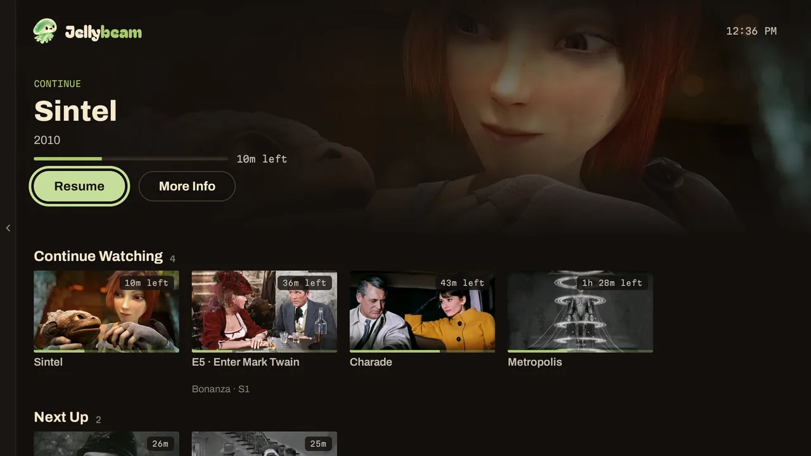
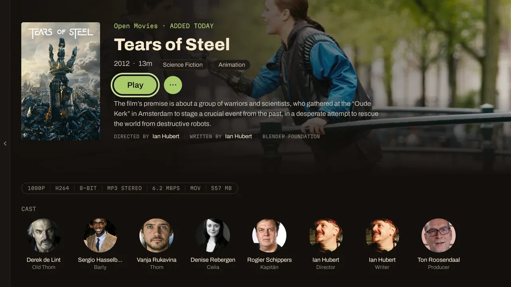
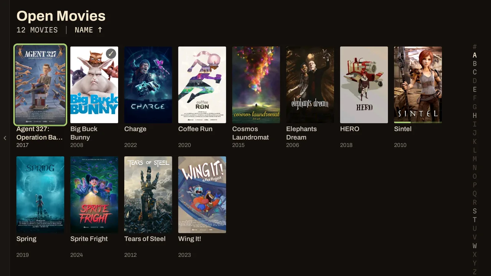
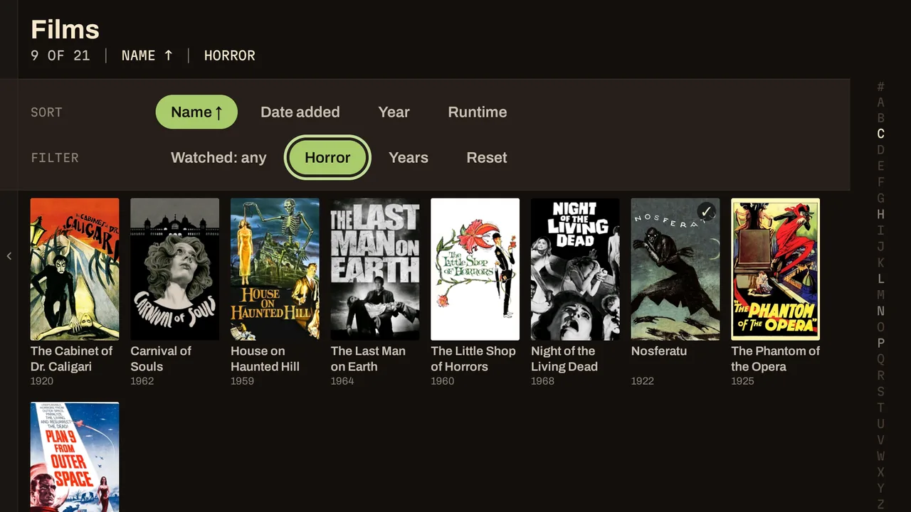
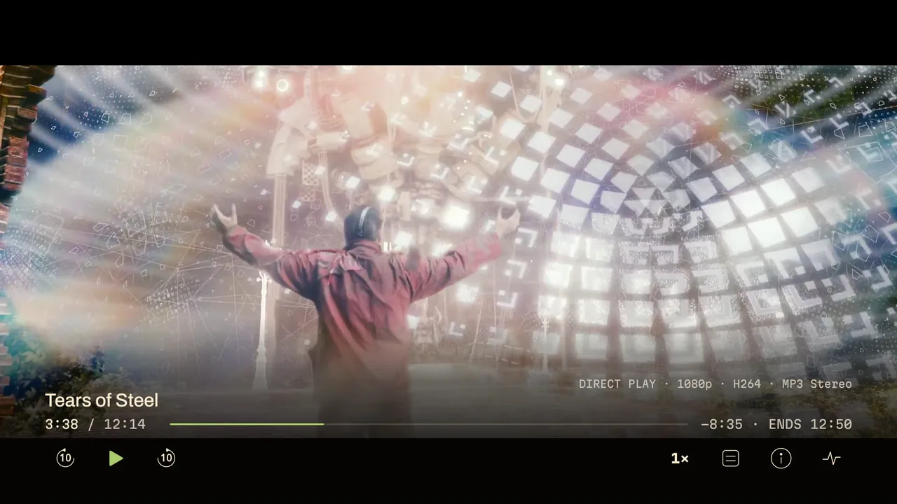
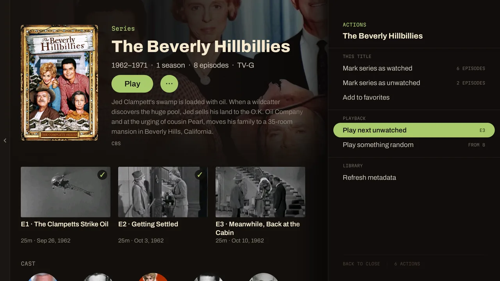
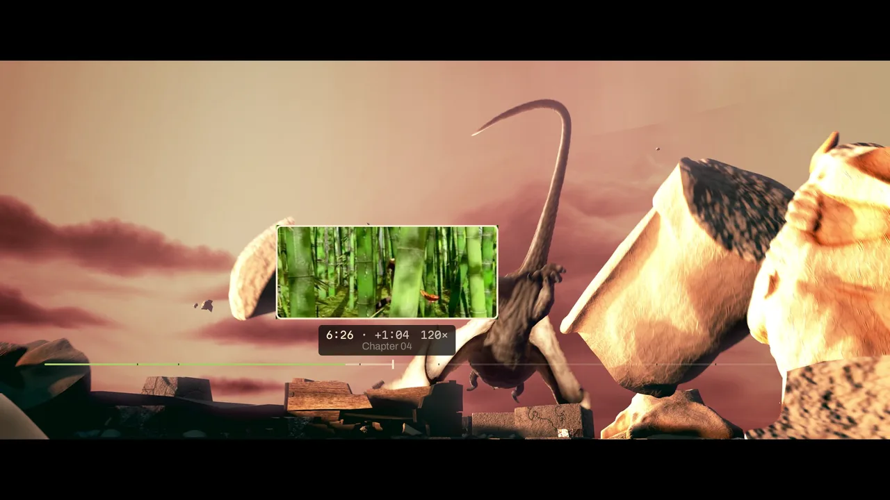

<div align="center">


### The Jellyfin client for people who notice the spinner.

<a href="https://github.com/packetinspector/jellybeam/releases"></a>    

</div>

<br>

## Jellybeam Features

- **A Rust core.** The sync engine, the mirror, every playback decision: Rust, memory-safe, and unit-tested. Kotlin only draws.
- **No spinners.** Your library lives in a SQLite mirror on the TV. Shelves, grids, seasons, search, sort and filter never wait on the server.
- **More Direct Play than you're used to.** The TV's decoders are probed, not assumed. Files other clients transcode play as files here.
- **TrueHD, DTS, DTS-HD, Atmos, HDR10, Dolby Vision.** Decoded on the device or passed straight through. The server stays cool.
- **Seerr is built in.** Trending, upcoming, search, request. From the couch, with the remote.
- **A player that was designed, not inherited.** Glyph-only OSD, chapter ticks, skips per segment type.
- **Glide Seek with trickplay.** Hold Left or Right and the file glides at 6x, 30x, then 120x, with the server's own thumbnails on screen the whole way. Release and it seeks once, exactly where you stopped.
- **Picture-in-picture.** Back or Home during playback tucks the video into a corner and keeps it playing while you browse.
- **Fast enough to measure in milliseconds.** First frame around 80 ms. Press Play to player-prepare around 50 ms.
- **Nothing phones home.** No analytics, no crash SDK, no telemetry. Two permissions: internet and network state.

<br>

<p align="center"></p>

<table>
<tr>
<td width="50%"></td>
<td width="50%"></td>
</tr>
<tr>
<td></td>
<td></td>
</tr>
</table>

<sub>Screenshots use public-domain films and Blender Foundation open movies (CC BY) on a demo server.</sub>

<br>

## Speed


- **Live, not polled.** A scan on the server, a new episode, a played flag from your phone: on the TV in a second or two, no refresh.
- **Home is ready when the app is.** Your session, your library and the Home screen load together, not one after another.
- **Fast from the first launch.** The app ships pre-optimized, so there is no slow first week while Android figures it out.
- **Play is prefetched.** Rest on a card and the playback handshake is done before you press, so your binge session starts even faster.
- **Syncs don't freeze the screen.** Browse through a library scan; nothing goes stale or stutters.
- **Rust where it counts.** Sync, queries and playback policy run native, link-time optimized, with no garbage collector in the hot path.
- **Measured, not assumed.** Startup, play and every browsing frame are timed on the real release build, so a slowdown gets caught before it ships.

<br clear="right">

## Direct Play, pushed as far as it goes


- **A real decoder probe, every startup.** Codecs, profiles, levels, resolutions, read from the hardware, so the server hears what your TV can really do.
- **Mislabeled levels don't cost you.** HEVC files that over-state their level in the container still play at full HDR quality instead of being transcoded. On by default; a switch if you insist.
- **Jellyfin's FFmpeg audio decoder is bundled.** TrueHD, DTS, DTS-HD and EAC3 decode on the device. Atmos reaches your receiver untouched.
- **Subtitles from the container.** SRT, TTML, WebVTT, ASS, PGS, VobSub. No burn-in transcode to show a caption.
- **Transcoding is a setting, not a surprise.** Direct Play refuses rather than downgrading. Auto and bitrate caps are opt-in, and the OSD says `TRANSCODE` and why.
- **Jellyfin 12 ready.** Tested against 12.x and good to go, including the new authorization rules.

<br clear="right">

## Seerr, built in


- **Connect once** in Settings and Discover appears in the drawer.
- **Trending, Upcoming, Movies, TV.** Shelves and paged grids with sort and genre filters.
- **One search box for both.** Your library answers instantly; Seerr results follow in their own section, ready to request.
- **Title pages** with backdrop, cast, scores, availability, Similar and Recommended.
- **Request and Request 4K.** Quality-profile and root-folder pickers, per-season pickers for TV, and a Go to library shortcut for what's already yours.
- **Free when it's off.** Not configured means not one network call. An unreachable Seerr never touches playback.

<br clear="right">

## The craft

The small things, learned from a lot of evenings on the couch with a lot of clients.

- **Next up that knows where the credits are.** Autoplay counts down from the show's own credits marker, not a fixed offset from the end of the file. Intro, recap, preview, commercial and credits each get their own Ask, Auto-skip or Off.
- **Falling asleep is not consent.** After a run of untouched episodes, a "Still watching?" prompt replaces the countdown. Stop reports the one you finished and never the next.
- **An OSD that gets out of the way and still has everything.** Minimal for a clean picture; Full adds the codec strip, an ENDS clock that tells you what time the episode finishes, speed and stats. On demand: a full stream breakdown and a library-info panel, fetched only when you ask.
- **Honest buffering.** A buffering pill appears when the network is actually behind, and never for a routine decoder reposition. Reconnecting gets its own pill. You always know why you're waiting.
- **A movie filter that thinks like you do.** Watched, unwatched, genre, decade, runtime, and Continuing or Ended for shows, with a summary line that always says what's applied and a right-edge rail that jumps the grid by letter, month, decade or duration.
- **A context menu with the shortcuts you actually use.** Play a random episode, play from the beginning, play the next unwatched, mark a season or series watched, favourite it, add it to a collection, jump to the series from an episode. One press on `···` from any detail page.

  

- **Series pages open on the season you're actually watching.** Your own season choice is never overridden.
- **Sorting uses the server's sort name.** "The" and leading numbers behave the way you expect.
- **Fast, configurable seeking.** Skip back and forward at 5, 10, 15, 30 or 60 seconds, set separately for each direction; hold for Glide Seek.
- **Glide Seek with trickplay.** Hold to glide through the file at 6x, 30x and 120x, then a pace that crosses the whole file in about eight seconds. The server's trickplay thumbnail stays up the entire hold, re-sampled at a readable pace and never blanking, and sheets are fetched one ahead, so it feels the same over a VPN as on your LAN.

  

- **Sign-in that fixes itself.** If a saved account has expired, you go straight to re-authorizing it, and your library is right where you left it.
- **Dead server addresses get re-resolved.** If your server advertises a bare hostname on the LAN, discovery probes the real ports and offers one that answers.
- **A mascot with manners.** It greets you on launch, keeps you company on an empty library or a pairing screen, and never covers your posters.
- **Names are yours.** Servers, libraries and items appear exactly as you named them. Nothing gets prettified.
- **Bug reports from the couch.** Settings > Troubleshooting > Report a problem puts a QR code on the TV. Scan it with your phone and a prefilled GitHub issue opens, with a redacted diagnostic log if you choose to attach it. Nothing leaves the TV until you press submit.

## Install

Grab the APK from [Releases](https://github.com/packetinspector/jellybeam/releases) and sideload it: `adb install jellybeam-tv-<version>.apk`, or a file manager on the TV. Type a server address or let LAN discovery find it, then pair with Quick Connect or a password.

<details>
<summary><strong>Play an item from outside the app</strong></summary>

```sh
adb shell am start -a tv.jellybeam.action.PLAY \
  -p tv.jellybeam --es tv.jellybeam.extra.ITEM_ID '<item-id>'
```

```sh
adb shell am start -a android.intent.action.VIEW \
  -p tv.jellybeam -d 'jellybeam://play/<item-id>'
```

Both take only a Jellyfin item id. The active account plays it.

</details>

## Build it yourself

One Docker container holds the Android SDK and NDK, Rust and cargo-ndk. Nothing else touches your machine.

```sh
./build.sh image     # once
./build.sh release   # R8-minified APK with its Baseline Profile
./build.sh test      # Rust workspace tests, then Kotlin unit tests
```

[docs/00](docs/00-START-HERE.md) is the map, [docs/10](docs/10-perf-logging.md) has the speed numbers and how they're measured, [CONTRIBUTING.md](CONTRIBUTING.md) has the gates.

## Something broke

Use the in-app report (see The craft) or open an [issue](https://github.com/packetinspector/jellybeam/issues/new/choose). The report page fills in the device, server version and log for you.

<br>

<div align="center">


<sub>GPL-3.0-or-later. The Jellybeam name, wordmark and mascot are reserved; see <a href="TRADEMARKS.md">TRADEMARKS.md</a>.</sub>

</div>
